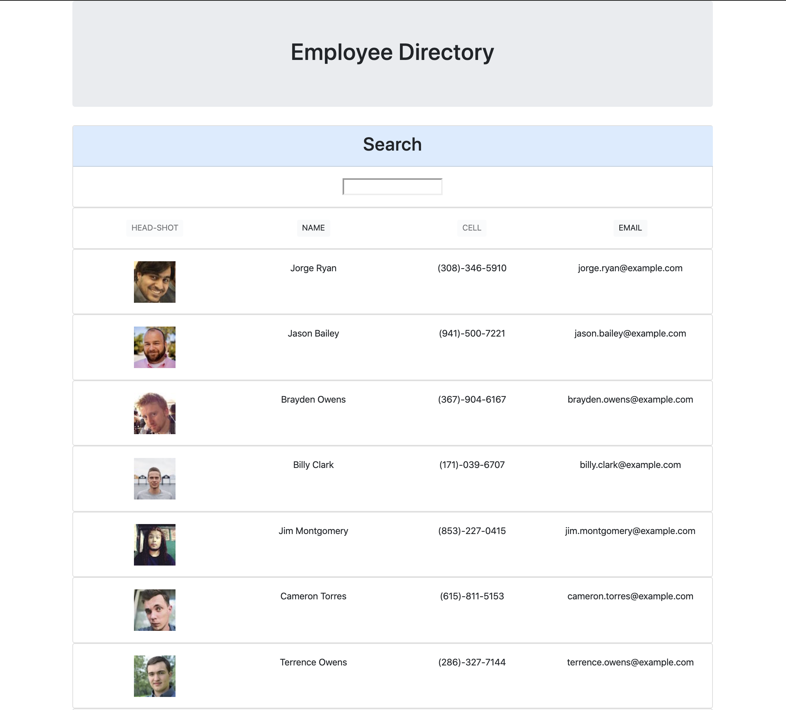

# 19-Employee-Directory

As a user, I want to be able to view my entire employee directory at once so that I have quick access to their information.

# About

This app was built with vanilla javascript and React.js. You can filter and sort using the search input, and by using the name and email buttons.

   
  <a href="https://johnsasser.github.io/19-Employee-Directory/">Employee Directory</a> 
   
  

# Description

This app is using mock data from the randomuser.me API. It is replaceable with any companies database records, GitHub users or even by utilizing the linkedIn api. It is designed and built to demonstrate the basic understanding or how react components are rendered through the virtual DOM, the use of Props & class components.

# Built with

- JavaScript
- React.js
- CSS

# Banter

    -   ALGORITHM OF SUCCESS
    while(noSuccess){
        tryAgain();
    if(dead)
    break();
    }
